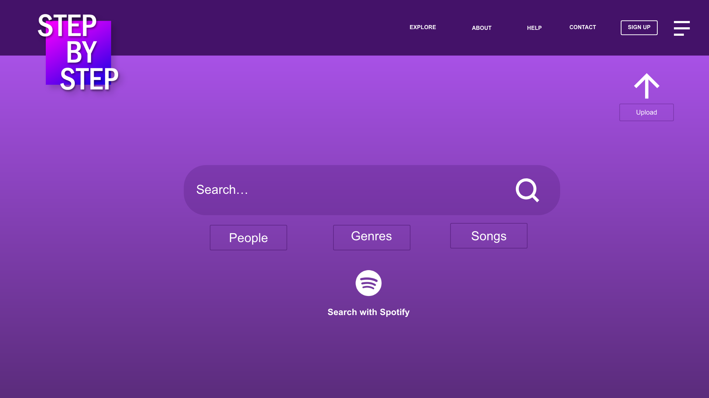
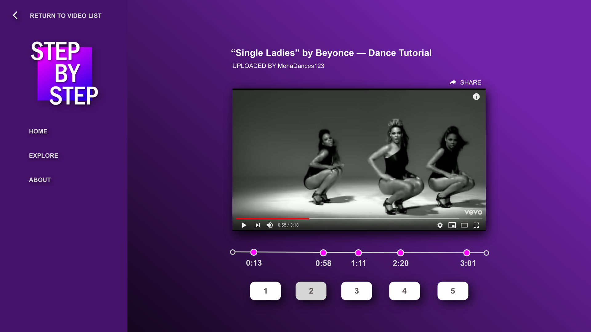
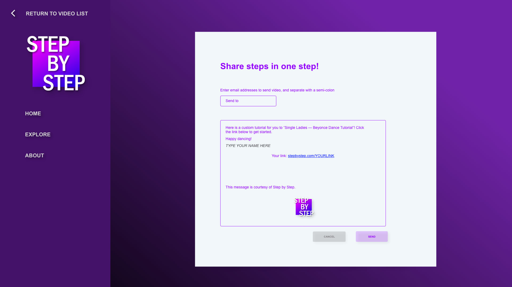

# Team 13 Project Proposal
Isaac Herman, Janna Sokolow, Meha Elhence, Will Glockner

## Project title
Step by Step

## Problem statement
Learning choreography should not be limited to learning in a physical dance studio. Dance tutorial videos exist online on popular sites such as YouTube and Facebook, but they are rarely well-suited to individual, self-teaching. Most importantly, this is because there is no way to automatically jump to certain intervals in the video. This makes practice by repetition extremely difficult. An aspiring dancer or hopeful learner should be able to gain the experience of a professional dance class from the comfort of their own home.

## How will we solve the problem?
Our proposed solution would allow choreographers/dancers to break up YouTube videos in accordance with individual dance moves or steps. Learners can click through the timestamps of moves and watch them on an automatic loop in order to better learn the overall dance.

## List of features
1. Users can search for YouTube videos, views results, and click on a specific result to watch the video.
2. On keydown event (i.e. spacebar), our site will store the current timestamps in links/buttons that will be posted to the page.
3. Upon clicking on these links/buttons, the video will jump to the specific time in the video denoted by the button/link — each looped clip is analogous to a "mini" YouTube video.     
4. This clip will continuously loop through the time interval that was chosen by the user.
5. Users can share their selected intervals via an automated email that contains links to specific timestamps.

## Data our prototype will be collecting
- Existing video data (YouTube)
- Data on user's custom timestamp selection

## Algorithms/special techniques  
- On keydown event, grab current timestamp from YouTube video and store that timestamp in an array. Loop through this array and generate links/buttons to those times in the video. Post these links to the page of the site.
- Upon clicking a link/button, the YouTube video will continuously loop through the interval defined by that link/button.  

## Wireframes

## Comments by Ming
* A total yes!  Love this idea. (testing)
